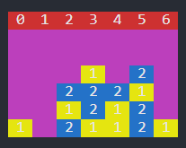
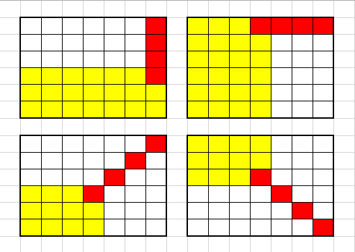

Connect Four Algorithm
============================

In order for the robot to play competitively against a human, a game algorithm is used to choose the best move in response to the human player. The algorithm's 'game loop' is implemented inside the main file, but for general tidiness we store all of the functions in a separate file.

Setup Functions
-----------------

Create a numpy array of zeroes to represent the Connect 4 board. This will be populated with numbered pieces throughout the game.

.. code-block:: python

    def create_board():
        board = np.zeros((ROW_COUNT, COLUMN_COUNT))
        return board

Set up the board to print out in the terminal in a way that makes it visually easy to play with the computer.

.. code-block:: python

    def pretty_print_board(board):
        flipped_board = np.flipud(board)

        print("\033[0;37;41m 0 \033[0;37;41m 1 \033[0;37;41m 2 \033[0;37;41m 3 \033[0;37;41m 4 \033[0;37;41m 5 \033[0;37;41m 6 \033[0m")
        for i in flipped_board:
            row_str = ""

            for j in i:
                if j == 1:
                    #print(yellow)
                    row_str +="\033[0;37;43m 1 "
                elif j ==2:
                    row_str +="\033[0;37;44m 2 "
                else:
                    #print black
                    row_str +="\033[0;37;45m   "
                    
            print(row_str+"\033[0m")

.. note:: 

    Due to restrictions on the version of numpy, ``np.flipud(board)`` was used instead of the most up to date version: ``np.flip(board)``.
    If you are using the most up to date version of numpy, you can update this function (although it will not break if you do not - numpy has reasonably good backwards-compatibility).
    The algorithm fills the board from the top down, whereas in real life the board fills up from the bottom. ``np.flipud(board)`` flips the board about a horizontal axis, making it the correct visual orientation for Connect 4.

There are 4 functions that are used when placing a piece on the board.

1. To get all locations in the board that could contain a piece (i.e. have not yet been filled):

.. code-block:: python

    def get_valid_locations(board):
        valid_locations = []
        for col in range(COLUMN_COUNT):
            if is_valid_location(board, col):
                valid_locations.append(col)
        return valid_locations

2. To check if there is a valid location in the chosen column:

.. code-block:: python

    def is_valid_location(board, col):
        return board[ROW_COUNT - 1][col] == 0

3. To check which row the piece can be placed into (i.e. the next available open row):

.. code-block:: python

    def get_next_open_row(board, col):
        for r in range(ROW_COUNT):
            if board[r][col] == 0:
                return r

4. Finally, to place a piece in the next available row, in the chosen column:

.. code-block:: python

    def drop_piece(board, row, col, piece):
        board[row][col] = piece

Analysis Functions
-----------------------

When the human player (Player 1) has made a move, the ``drop_piece`` function will update the numpy array ``board`` with a 1. In order for the game algorithm (Player 2) to choose the best move to play in response, it has to understand and analyse the current board state. This is done using a 'windowing' technique.
In the following function, horizontal, vertical, positive (upward sloping) and negative (downward sloping) diagonal windows are created. These windows are then used to scan all possible 4-piece sections of the board, and evaluate (score) each window based on its contents. 

This evaluation is performed separately by the ``evaluate_window`` function, which is called within the ``score_position`` function, and explained in further detail below.

.. code-block:: python
    :emphasize-lines: 14, 22, 29, 36

    def score_position(board, piece):
        score = 0

        # Score centre column
        centre_array = [int(i) for i in list(board[:, COLUMN_COUNT // 2])]
        centre_count = centre_array.count(piece)
        score += centre_count * 3

        # Score horizontal positions
        for r in range(ROW_COUNT):
            row_array = [int(i) for i in list(board[r, :])]
            for c in range(COLUMN_COUNT - 3):
                # Create a horizontal window of 4
                window = row_array[c:c + WINDOW_LENGTH]
                score += evaluate_window(window, piece)

        # Score vertical positions
        for c in range(COLUMN_COUNT):
            col_array = [int(i) for i in list(board[:, c])]
            for r in range(ROW_COUNT - 3):
                # Create a vertical window of 4
                window = col_array[r:r + WINDOW_LENGTH]
                score += evaluate_window(window, piece)

        # Score positive diagonals
        for r in range(ROW_COUNT - 3):
            for c in range(COLUMN_COUNT - 3):
                # Create a positive diagonal window of 4
                window = [board[r + i][c + i] for i in range(WINDOW_LENGTH)]
                score += evaluate_window(window, piece)

        # Score negative diagonals
        for r in range(ROW_COUNT - 3):
            for c in range(COLUMN_COUNT - 3):
                # Create a negative diagonal window of 4
                window = [board[r + 3 - i][c + i] for i in range(WINDOW_LENGTH)]
                score += evaluate_window(window, piece)

        return score

The figure below shows the scanning range for this ``score_position`` function. It is unnecessary to use every index of the board as a starting position for a scanning window, because in many positions some windows would then extend over the sides of the board.
As a result, there are only 69 positions in which the scanning window needs to be deployed. The yellow highlight shows the applicable scanning range, and the red squares are an example of a scanning window in the maximum required position.

The ``evaluate_window`` function is called in the last line of each scoring block. The output of this evaluation function (a numerical score value) is stored in the ``score`` variable, which is updated every time a higher score is found. 
When the scanning is complete, the window with the best score is passed to the game algorithm to play a move. Note that this scoring mechanism is required, but the minimax function, which will be explained in further detail, makes some elements of this function much less important.

In any given scanning position, the contents of that window are evaluated for 'strength', e.g. a window that contains 3 consecutive pieces from the same player is a 'strong' state, and has a higher score. 
This means that the algorithm is more likely to try and create board states that are 'strong' - i.e. prioritise connecting 3 pieces together, rather than connecting 2.

.. code-block:: python

    def evaluate_window(window, piece):
        score = 0
        # Switch scoring based on turn
        opp_piece = PLAYER_PIECE
        if piece == PLAYER_PIECE:
            opp_piece = BOT_PIECE

        # Prioritise a winning move
        # Minimax makes this less important
        if window.count(piece) == 4:
            score += 100
        # Make connecting 3 second priority
        elif window.count(piece) == 3 and window.count(EMPTY) == 1:
            score += 5
        # Make connecting 2 third priority
        elif window.count(piece) == 2 and window.count(EMPTY) == 2:
            score += 2
        # Prioritise blocking an opponent's winning move (but not over bot winning)
        # Minimax makes this less important
        if window.count(opp_piece) == 3 and window.count(EMPTY) == 1:
            score -= 4

        return score

The final element of the analysis is a 'special case' variation of the ``score_position`` function. When 4 pieces are joined together, this signifies the game has been won. 
After every move, the board needs to be scanned by both the ``score_position`` function, and also the ``winning_move`` function, which will exit out of the game loop if it sees a winning move.

.. code-block:: python

    def winning_move(board, piece):
        # Check valid horizontal locations for win
        for c in range(COLUMN_COUNT - 3):
            for r in range(ROW_COUNT):
                if board[r][c] == piece and board[r][c + 1] == piece and board[r][c + 2] == piece and board[r][c + 3] == piece:
                    return True

        # Check valid vertical locations for win
        for c in range(COLUMN_COUNT):
            for r in range(ROW_COUNT - 3):
                if board[r][c] == piece and board[r + 1][c] == piece and board[r + 2][c] == piece and board[r + 3][c] == piece:
                    return True

        # Check valid positive diagonal locations for win
        for c in range(COLUMN_COUNT - 3):
            for r in range(ROW_COUNT - 3):
                if board[r][c] == piece and board[r + 1][c + 1] == piece and board[r + 2][c + 2] == piece and board[r + 3][c + 3] == piece:
                    return True

        # check valid negative diagonal locations for win
        for c in range(COLUMN_COUNT - 3):
            for r in range(3, ROW_COUNT):
                if board[r][c] == piece and board[r - 1][c + 1] == piece and board[r - 2][c + 2] == piece and board[r - 3][c + 3] == piece:
                    return True

Algorithm
------------------------

The algorithm chosen to play Connect 4 is the minimax algorithm. Minimax is a backtracking algorithm which is commonly used in decision-making and game theory to find the optimal move for a player.
This makes it a perfect choice for two-player, turn-based games. 

In the minimax algorithm, the two players are the maximiser and minimiser. The maximiser is trying to get the highest score possible, and the minimiser is trying to get the lowest score possible. 
The best / worst scores are calculated by the ``evaluate_window`` function, and stored in the ``score`` variable, described in the previous section.

At the start of every turn, minimax will scan the board's remaining valid locations and calculate all possible moves, before backtracking and choosing the optimal move for that turn. This will be either the best or worst move, depending on whether it is the maximiser or minimiser's turn.
The assumption is that minimax (maximiser) can play optimally, as long as the human player (minimiser) also plays optimally. This will not always be the case, but does not lead to significant gameplay problems.

Before implementing the minimax algorithm, the two game-terminating states need to be defined as terminal nodes. If there is a winning move from either player, or if the board fills up without a win (leading to a draw), the game will end.

.. code-block:: python

    def is_terminal_node(board):
        return winning_move(board, PLAYER_PIECE) or winning_move(board, BOT_PIECE) or len(get_valid_locations(board)) == 0

The minimiax algorithm for the Connect 4 game is implemented below.

.. code-block:: python

    def minimax(board, depth, alpha, beta, maximisingPlayer):
        valid_locations = get_valid_locations(board)

        is_terminal = is_terminal_node(board)
        if depth == 0 or is_terminal:
            if is_terminal:
                # Weight the bot winning really high
                if winning_move(board, BOT_PIECE):
                    return (None, 9999999)
                # Weight the human winning really low
                elif winning_move(board, PLAYER_PIECE):
                    return (None, -9999999)
                else:  # No more valid moves
                    return (None, 0)
            # Return the bot's score
            else:
                return (None, score_position(board, BOT_PIECE))

        if maximisingPlayer:
            value = -9999999
            # Randomise column to start
            column = random.choice(valid_locations)
            for col in valid_locations:
                row = get_next_open_row(board, col)
                # Create a copy of the board
                b_copy = board.copy()
                # Drop a piece in the temporary board and record score
                drop_piece(b_copy, row, col, BOT_PIECE)
                new_score = minimax(b_copy, depth - 1, alpha, beta, False)[1]
                if new_score > value:
                    value = new_score
                    # Make 'column' the best scoring column we can get
                    column = col
                alpha = max(alpha, value)
                if alpha >= beta:
                    break
            return column, value

        else:  # Minimising player
            value = 9999999
            # Randomise column to start
            column = random.choice(valid_locations)
            for col in valid_locations:
                row = get_next_open_row(board, col)
                # Create a copy of the board
                b_copy = board.copy()
                # Drop a piece in the temporary board and record score
                drop_piece(b_copy, row, col, PLAYER_PIECE)
                new_score = minimax(b_copy, depth - 1, alpha, beta, True)[1]
                if new_score < value:
                    value = new_score
                    # Make 'column' the best scoring column we can get
                    column = col
                beta = min(beta, value)
                if alpha >= beta:
                    break
            return column, value

.. Note::

The implementation of this minimax algorithm also contains Alpha-Beta pruning. There is no point following a decision-tree branch any further if the initial move scores less optimally than an alternative that has already been discovered. 
Alpha-Beta pruning works to 'prune' away these branches, leaving a much smaller, more optimised decision tree.

This technique is used to reduce the time complexity of the algorithm, which in this context is important, as there are many other parts of the game loop that are time consuming (e.g. Motion Planning). 
The game algorithm can now run reliably in under 500ms, even when looking 4 moves into the future.

Limitations / Improvements
---------------------------