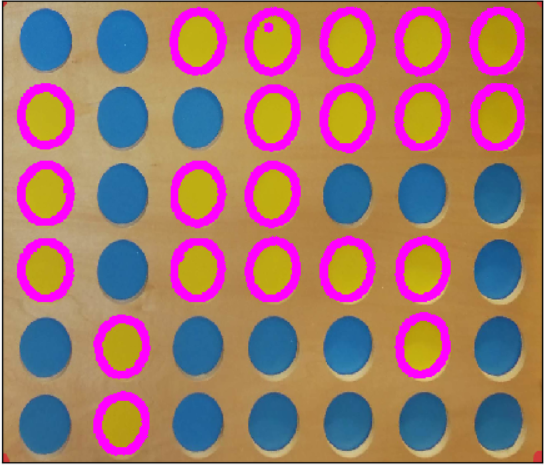

Open CV Overview
===============================
OpenCV is used to allow the robot to update the state of the board and know where the human has played without requiring any inputs.
It is also used for error prevention and recovery, as will be further explained.

System Overview for Counter position detection:
--------------------------------------------------

This code is called by the decision making algorithm when it needs to know the current position of the placed counters.

In the game of connect 4 counters are placed into columns inside of the grid. One of the major tasks for machine vision is figuring out the current position of the counters in play.

It then needs to find the new counter that has been placed in the board by the human.

Currently the algorithm for counter detection can be split into five separate stages:

1. The webcam currently attached to the system takes a picture of the board in its current state.

2. The machine vision detects the four corners of the connect 4 grid.
White Masks:

3. The system warps the image so that just the connect 4 grid is shown in a planer projection.

4. The image detects the position of all the counters in play and calculates in which column each of the counters falls into.
New disk:

5. The location of all the counters is returned in the form of a numpy array. This is saved as board1

These steps are then repeated again. This outputs another board state in the form of a numpy array, saved as board2. Then board1 is subtracted from board2 to find where the new counter is.

The column and the row of the new counter are found and the column is returned to the connect 4 playing algorithm to continue the game.

How the code works:
--------------------------------------------------
1. Taking a snapshot with the webcam, and then putting it through the position finding algorithm:

.. code-block:: python

  def SnapShotAndPossition():
      camera = cv2.VideoCapture(0)
      for i in range(10):
          __, frame = camera.read()
      frame = cv2.fastNlMeansDenoisingColored(frame,None,10,10,7,21)
      ImageInlineShow(frame)
      Board = GetPossitions(frame , Location = False)
      camera.release()
      return Board

Where the position finding algorithm is the following:

.. code-block:: python

  def GetPossitions(img ,Location = True):
      if Location:
           img = cv2.imread(img)

      SquareImage = TransformTheImage(img,200)
      #If the Extra space at the top starts causing problems.

      #The Blue mask
      lower_blue = np.array([90,130,80])
      upper_blue = np.array([115,255,255])

      blueContours, __ = ConvectionFunction(SquareImage,[lower_blue] , [upper_blue])
      blue_coordinates = ContourInfo(blueContours , 800)

      #The Yellow Mask
      lower_yellow = np.array([20,55,70])
      upper_yellow = np.array([45,191,200])

      yellowContours, __ = ConvectionFunction(SquareImage,[lower_yellow], [upper_yellow])
      yellow_coordinates = ContourInfo(yellowContours , 800)

      mergedy = get_row_and_col(get_x_and_y_coord_from_contours(yellow_coordinates))
      mergedb = get_row_and_col(get_x_and_y_coord_from_contours(blue_coordinates))
      Board = ArrayfromCordinates(mergedb,mergedy)
      return disks_to_array(Board)

It reads an image from the given Image Location, flattens it, finds the yellow and the blue disks,
and returns the rows and columns of each of the disks.

3. From the pixel coordinates of the disks, finding the row and column that they fall into:
This fucntion takes the pixel coordinates in the form of [cX ,cY], and returns the row for cX, and column for cY

.. code-block:: python

  def get_row_and_col(coordinates):
  Tolerance = 20 #a tolerance is added to check the coordinate in the row/column are within a range.
  xList = []
  yList = []
  KeyX = [55 , 155 , 250 , 345 , 450 , 545 , 640] #these are the estimated pixels in which the coordinates for each column lie in
  KeyY = [200 , 330 , 430 , 530 , 650 , 760] #these are the estimated pixels in which the coordinates for each row lie in
  for i in coordinates:
      y_coord = i[1]
      x_coord = i[0]
      for n,x in enumerate(KeyX):
          if abs(x_coord - x) < Tolerance: #a tolerance is added to check the coordinate in the row/column are within a range.
              xList.append(n)
              break
      else:
          print("x out" , x_coord)
          pass
      for n,y in enumerate(KeyY):
          if abs(y_coord - y) < Tolerance:
              yList.append(n)
              break
      else:
          xList.pop(-1)
          print("Y out" , y_coord)
  return [cord for cord in zip(xList , yList)]

4. Converting the board into a numpy array:
This function takes in the positions of all the disks on the board and returns a numpy
array with -1 for the bot disks and 1 for the player disks

.. code-block:: python

  def disks_to_array(board):
      for x in np.nditer(board, op_flags=['readwrite']):
          if x[...] == 1:
              x[...] = -1
          if x[...] == 2:
              x[...] = 1
      return board

5. Finding the newly placed disk by the human:
This function takes in the board state before the human plays (board1) and after they play
(board2), and subtracts them from each other. Where the result is not 0 it returns the column
and row of that position, which is where the new disk has been played

.. code-block:: python

  def where_is_the_new_disk(board1, board2):
      board_before = disks_to_array(board1)
      board_after = disks_to_array(board2)
      result = np.subtract(board_before, board_after)
      for x in np.nditer(result):
          if x[...] != 0:
              i, j = np.where(result != 0)
      return i, j #i is row, j is col

6. The column of the newly placed disk by the human is returned to the connect 4 playing algorithm.

Error detection with OpenCV:
--------------------------------------------------
1. One method used to check for errors was to run the code to find the position of the newly played disk by the human twice, and ensure that in both instances the result is the same.
Otherwise, repeat the same procedure until the new disk position is the same.

Firstly the yellow disks are found with the ``GetPossitions`` function mentioned above,

Then the blue disks, also found with ``GetPossitions``:

Then the centre coordinates are extracted with the following function:

.. code-block:: python

  def get_x_and_y_coord_from_contours(coordinates):
      counter = -1
      coords = []
      for i in coordinates:
          counter += 1
          y_coord = coordinates[counter][0][1]
          x_coord = coordinates[counter][0][0]
          coords.append([x_coord, y_coord])
      return coords

And then the row and column of each of the coordinates is found using this function:

.. code-block:: python

  def get_row_and_col(coordinates):
      Tolerance = 20 #a tolerance is added to check the coordinate in the row/column are within a range.
      xList = []
      yList = []
      KeyX = [55 , 155 , 250 , 345 , 450 , 545 , 640] #these are the estimated pixels in which the coordinates for each column lie in
      KeyY = [200 , 330 , 430 , 530 , 650 , 760] #these are the estimated pixels in which the coordinates for each row lie in
      for i in coordinates:
          y_coord = i[1]
          x_coord = i[0]
          for n,x in enumerate(KeyX):
              if abs(x_coord - x) < Tolerance:
                  xList.append(n)
                  break
          else:
              print("x out" , x_coord)
              pass
          for n,y in enumerate(KeyY):
              if abs(y_coord - y) < Tolerance:
                  yList.append(n)
                  break
          else:
              xList.pop(-1)
              print("Y out" , y_coord)
      return [cord for cord in zip(xList , yList)]

After this, the coordinates are used to make a numpy array:

.. code-block:: python

  def ArrayfromCordinates(Cordinates1, Cordinates2 = None):
      output = np.zeros((7,6))
      for co in Cordinates1:
          y,x = co
          output[y][x] = 1
      if Cordinates2 == None:
          return output
      for co in Cordinates2:
          y,x = co
          output[y][x] = 2
      return output

And then by taking multiple snapshots and performing this procedure twice the newly placed disk can be found:

.. code-block:: python

  def where_is_the_new_disk(board1, board2):
      board_before = disks_to_array(board1)
      board_after = disks_to_array(board2)
      result = np.subtract(board_before, board_after)
      for x in np.nditer(result):
          if x[...] != 0:
              i, j = np.where(result != 0)
      return i, j #i is row, j is col

By running this code twice and ensuring that on both instances the disk position found is the same it can be verified that the board has been updated to the correct state.

2. Another method that was developed for error recovery but never implemented was to draw a centre line on the column that the robot was about to place the disk in, and using a red marker on the centre of
the robot gripper, check that the coordinate of the marker on the gripper is aligned with the target column.

First the top and the bottom coordinates of the disks in each column are found:

.. code-block:: python

  def find_top_and_bottom_coord_of_each_col(col_no, row_no, new_lst, points):
      col_1 = []
      col_2 = []
      col_3 = []
      col_4 = []
      col_5 = []
      col_6 = []

      for i in range(len(row_no)):
          #print(i)

          if new_lst[i][1] == 0 and new_lst[i][0] == 0:
              col_1.append(points[i])
              print('found top disk of column 1', new_lst[i], points[i])

          if new_lst[i][1] == 0 and new_lst[i][0] == 5:
              col_1.append(points[i])
              #print('found bottom disk of column 1', new_lst[i], points[i])

          if new_lst[i][1] == 1 and new_lst[i][0] == 0:
              col_2.append(points[i])

          if new_lst[i][1] == 1 and new_lst[i][0] == 5:
              col_2.append(points[i])

          if new_lst[i][1] == 2 and new_lst[i][0] == 0:
              col_3.append(points[i])

          if new_lst[i][1] == 2 and new_lst[i][0] == 5:
              col_3.append(points[i])

          if new_lst[i][1] == 3 and new_lst[i][0] == 0:
              col_4.append(points[i])

          if new_lst[i][1] == 3 and new_lst[i][0] == 5:
              col_4.append(points[i])

          if new_lst[i][1] == 4 and new_lst[i][0] == 0:
              col_5.append(points[i])

          if new_lst[i][1] == 4 and new_lst[i][0] == 5:
              col_5.append(points[i])

          if new_lst[i][1] == 5 and new_lst[i][0] == 0:
              col_6.append(points[i])

          if new_lst[i][1] == 5 and new_lst[i][0] == 5:
              col_6.append(points[i])
      return col_1, col_2, col_3, col_4, col_5, col_6

Then after this, the target column is used as an input for the following function, where it plots the centreline in the snapshot taken:

Then using the existing code to find the red markers in the function ``GetPossitions``, the coordinate of that marker can be found, and calling the following function:

.. code-block:: python

  def get_row_and_col(coordinates):
      Tolerance = 20 #a tolerance is added to check the coordinate in the row/column are within a range.
      xList = []
      yList = []
      KeyX = [55 , 155 , 250 , 345 , 450 , 545 , 640] #these are the estimated pixels in which the coordinates for each column lie in
      KeyY = [200 , 330 , 430 , 530 , 650 , 760] #these are the estimated pixels in which the coordinates for each row lie in
      for i in coordinates:
          y_coord = i[1]
          x_coord = i[0]
          for n,x in enumerate(KeyX):
              if abs(x_coord - x) < Tolerance:
                  xList.append(n)
                  break
          else:
              print("x out" , x_coord)
              pass
          for n,y in enumerate(KeyY):
              if abs(y_coord - y) < Tolerance:
                  yList.append(n)
                  break
          else:
              xList.pop(-1)
              print("Y out" , y_coord)
      return [cord for cord in zip(xList , yList)]

It can be verified whether or not the gripper marker lies in the same column as the target column wherein the robot wishes to place the next disk.
