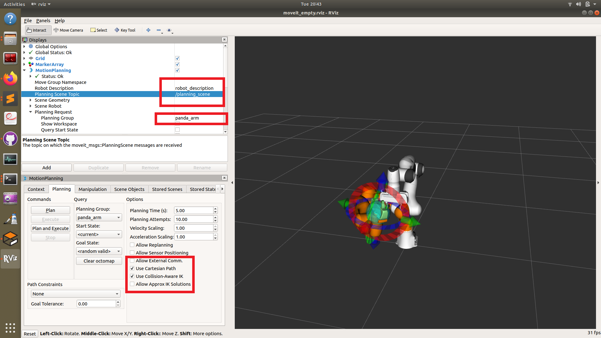

Simulating the robot
===============================

Before testing on the real robot, it is vital to test your code on a simulator. We use Gazebo to visulise the movement of the Panda Emika robot to see if it behaves properly. Form experience, IF and ONLY if it works in the simulation is there a REMOTE chance that your code will work on the actual robot. 

Word of advice: simulate, simulate, simulate. Until everything works perfectly in the simulation.

Note that the actual Franka Emika robot costs several thousand Euros, and you will have a very limited time with the actual robot. You can save a lot of time by simulating everything on your computer.

Running on Gazebo
----------------------
Open five termials and run the following commands in each:

Run Roscore, the master messaging core

.. code-block:: bash

    roscore

Now you open up Gazebo, the simulation software

.. code-block:: bash

    source devel/setup.bash
    rosrun gazebo_ros gazebo

Now open up Rviz, and open up the Movit motion planner plugin used for motion planning.

.. code-block:: bash

    source devel/setup.bash
    roslaunch panda_moveit_config demo.launch rviz_tutorial:=true

Now you need to activate motion planning using the Movit plugin.
You will have to run a motion planning move from the RVIZ gui, by opening the open planning tab. Then set the //TODO put in user group.

Run the ''panda_publisher.py'' utility that broadcasts movement of the joints and gripper such that gazebo knows that it has moved.

.. code-block:: bash

    cd src/panda_publisher
    python panda_publisher.py

Finally, spawn the robot arm in Gazebo.

.. code-block:: bash

    source devel/setup.bash
    roslaunch franka_gazebo panda_arm_hand.launch

Now for your reference, here is video showing the whole setup operation that will allow you to run a full simulation.

.. raw:: html

    

        <iframe src="https://drive.google.com/file/d/1zKt-nPKSKOXqZ7UHFkeTi5kBK8eA0pko/preview" width="640" height="480"></iframe>
    

