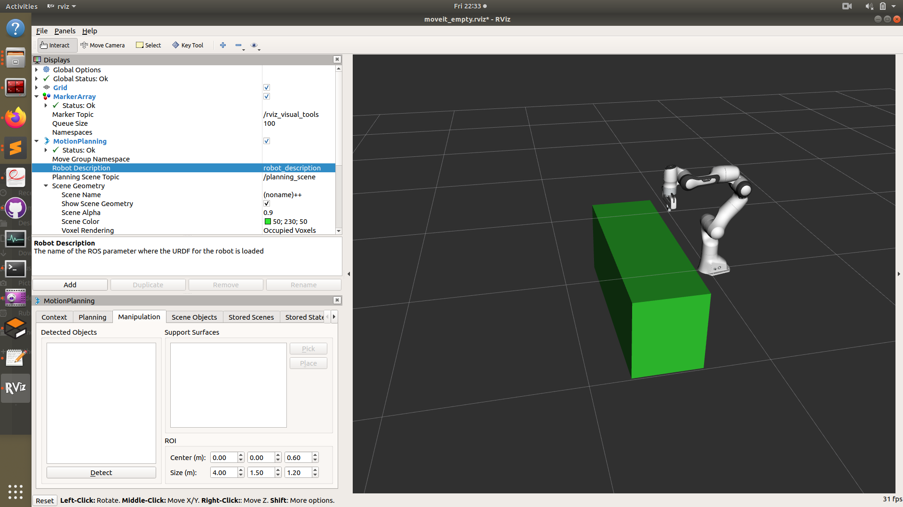
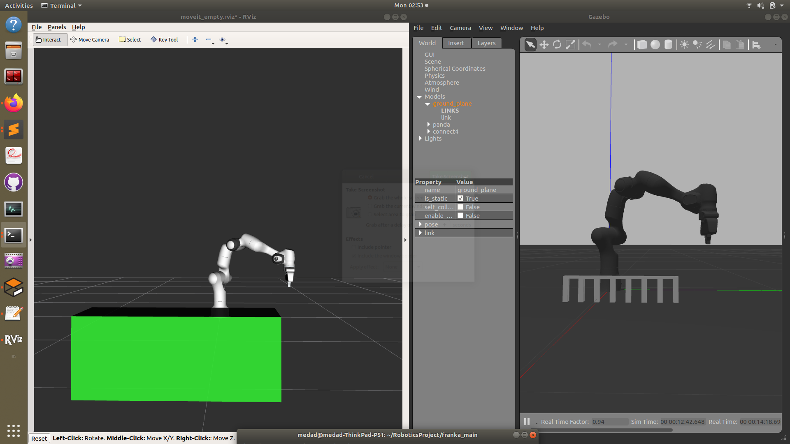

Motion planning
======================

We used the default motion planner in Movit, which uses the **Open Motion Planning Library**,OMPL,an open-source motion planning library that primarily implements randomized motion planners. It was used to plan the movement of robot gripper between locations such as from the token pick up point to the drop off point above the column.

Occasionally we observed that the planner seemed to plan a circuitous plan for the robot, or occasionally spinning around to reach its destination. We minimised the risk of this happening by adding additional waypoints. 

Collision Avoidance
--------------------------
The primary obstacle in the robot's workspace was the Connect 4 board. We had to tell Movit, the motion planner, to avoid getting any part of the robot to collide with the board. 

Two 3D models were required for collision detection. The 3D model of the robot, including all its links and of the connect 4 board.

The 3D models of the model was supplied by the robot manufacturer in the form of .dae mesh files. These files can be found in ``RoboticsProject\catkin_ws\src\franka_gazebo\meshes\visual`` .

.. note::

	The .dae mesh files are a lower resolution polygon mesh file compared to the .stl files supplied for visualisation. This is done to reduce computation load for collision detection.

In order to simplify computation, we defined the connect 4 board obstacle solely by a bounding box, a box that completely encompassed the volume of the connect 4 board.

For a comparison between the 3D models for visualisation collision detection, here is a photo of the 3D models of the connect 4 board. On the left is the bounding box obstacle used for collsion detection(rendered with Rviz) while on the right is the higher resolution model of the connect four board(rendered in Gazebo).

We could define the dimension, position and orientation of the obstacle with a few lines of code in the intial part of the main script running the game code. We define the position, orientation and dimensions of the box and pass that into the ``scene.add_box(obstacle_name, pose, dimensions)`` function that tells the motion planner the obstacle information.

.. code-block:: python

	p = geometry_msgs.msg.PoseStamped()
	p.header.frame_id = robot.get_planning_frame()
	p.pose.position.x = 0.4
	p.pose.position.y = -0.301298
	p.pose.position.z = -0.2
	p.pose.orientation.x =  0.0
	p.pose.orientation.y = 0
	p.pose.orientation.z = 0.0
	p.pose.orientation.w = 0.4440158
	scene.add_box("box", p, (0.5, 1.5, 0.6))
	rospy.sleep(2)

.. note::
	
	When you run the script to insert the box, you will notice that the obstacle(in green) does not immediately appear in the Rviz workspace GUI. The add_box method adds the object asynchronously so that RViz is not notified. The way to visualise this is to REMOVE the ``motion planning`` branch from the ``display`` tree in Rviz and add it back. Then the obstacle will appear. Note that you must make sure you have run scene.add_box method earlier. More information can be found in this question_
.. _question: https://answers.ros.org/question/209030/moveit-planningsceneinterface-addbox-not-showing-in-rviz/

