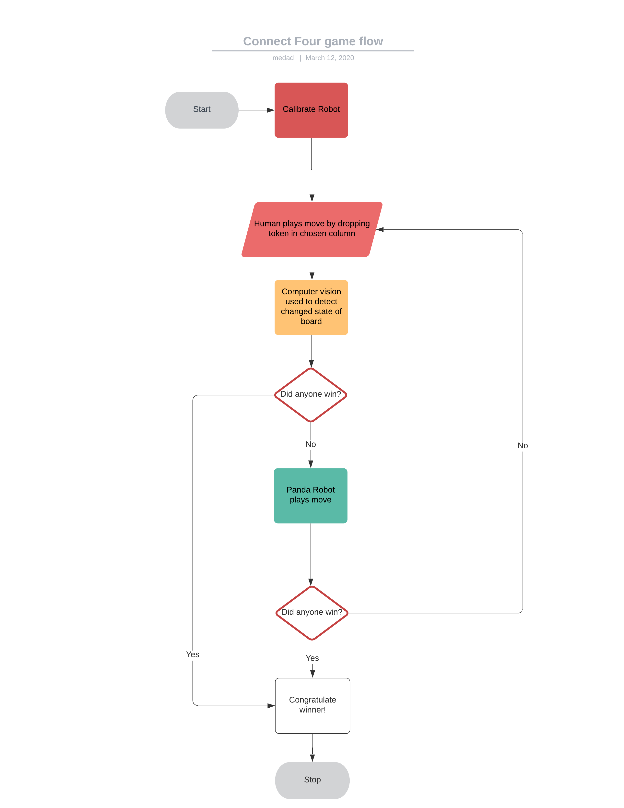

Overview
====================

In this project, we got the Franka Emika "Panda" robot to play a game of Connect 4 against a human. To do this, we implemented Computer Vision, a Minimax Game Algorithm, Motion Planning and Collision Detection.
We also carried out extensive simulations of the robot's motion using Gazebo for visualisation.

The different elements of the project were written in discrete python scripts, elements of which were than called and executed within a main file.

The flow chart below shows an overview of the steps that are executed in the main file.

Main File Breakdown
-------------------
