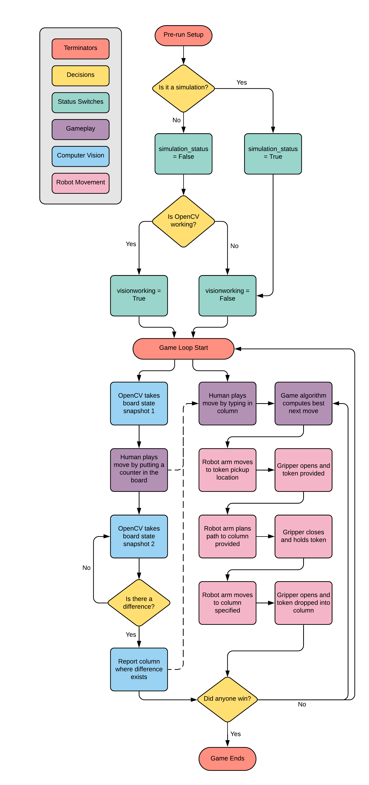

Overview & Main File Breakdown
===============================

.. warning::

    For best UI experience, please use the web_ version of the documentation as opposed to the PDF version.

.. _web: https://roboticsproject.readthedocs.io/en/latest/index.html

In this project, the Franka Emika "Panda" robot was programmed to play a game of Connect 4 against a human. To do this, multiple tools such as Computer Vision, a Minimax Game Algorithm, Motion Planning and Collision Detection were implemented.
Extensive simulations of the robot's motion were also performed using Gazebo for visualisation.

The different elements of the project were written in discrete python scripts, elements of which were than called and executed within a main file.

The flow chart below shows an overview of the steps that are executed in the main file.

Setup Functions
-------------------

The main file collates all the code that is split into separate files into one executable file. To do this effectively, first it is necessary to import all of the required external functions and python libraries.

.. warning::

    Although this is a python script, it will NOT run in an IDE in Windows. Many of the functions and libraries imported are specific for the ROS environment, which needs to be run inside a Virtual Machine, or on a ROS (Linux) dual-boot.

.. code-block:: python

    # Import required python files
    import c4_bot_functions as botfunc
    import open_cv as vision
    from c4_class import Connect4Robot

    # Import libraries
    import sys
    import copy
    import rospy
    import subprocess
    import moveit_commander
    import moveit_msgs.msg
    import geometry_msgs.msg
    import tf
    from IO import bcolors
    from time import sleep
    from math import pi
    from std_msgs.msg import String, Float64MultiArray, MultiArrayDimension, Float64
    from moveit_commander.conversions import pose_to_list

To aid debugging, a number of simple state-switching tools were included. Due to the limited access to the physical robot, most of the testing was done in simulation.
Although the code operation for each state is similar, there are some small differences in code required to make the simulation run (particularly effective operation of the grippers).
These differences are highlighted in the 'Robot Movement' section of the documentation, and this switch is used to toggle between the code blocks.

In addition to this, OpenCV took a long time to develop and test, so in the meantime a switch was used so that the rest of the code could be tested without relying on computer vision.

.. code-block:: python

    simulation_status = True
    visionworking = False

When everything has been imported, the Franka Emika robot needs to be set up and initialised. The following code shows the setup procedure for this robot.

.. code-block:: python

    # Set up Franka Robot
    moveit_commander.roscpp_initialize(sys.argv)
    rospy.init_node('panda_demo', anonymous=True)
    robot = moveit_commander.RobotCommander()
    scene = moveit_commander.PlanningSceneInterface()
    rospy.sleep(2)

    # Get object frames
    p = geometry_msgs.msg.PoseStamped()
    #p = PoseStamped()
    p.header.frame_id = robot.get_planning_frame()
    p.pose.position.x = 0.4
    p.pose.position.y = -0.301298
    p.pose.position.z = -0.2
    p.pose.orientation.x =  0.0
    p.pose.orientation.y = 0
    p.pose.orientation.z = 0.0
    p.pose.orientation.w = 0.4440158
    #scene.add_mesh("Connect4", p,"connect4.STL")
    scene.add_box("table", p, (0.5, 1.5, 0.6))
    rospy.sleep(2)

    display_trajectory_publisher = rospy.Publisher('/move_group/display_planned_path', moveit_msgs.msg.DisplayTrajectory, queue_size=20)

    # This command makes ros to change the 'allowed_start_tolerance' to 0.05. Prevents controller failure
    ros_setup_message = """
    rosservice call /move_group/trajectory_execution/set_parameters "config:
    doubles:
        - {name: 'allowed_start_tolerance', value: 0.05}"
    """
    subprocess.call(ros_setup_message, shell=True)

    PandaRobot = Connect4Robot()

After setup, it is necessary to define all of the positions that the robot arm will need to visit during calibration and gameplay. This also means that simple function calls can be used for each position later in the game loop section of the code.
The positions were as follows: left & right corners (calibration), columns 0-6 (gameplay), and disk collection (resting position).

.. code-block:: python

    # Calibration positions
    PandaRobot.define_coordinates([0.3, 0.35, 0.3, pi, 0, pi / 4])

    # Initialise the positions the robot has to visit
    PandaRobot.AddPosition("DiskCollection",
                        [PandaRobot.x1,
                            PandaRobot.y1 + 0.2,
                            PandaRobot.z1 + 0.1,
                            PandaRobot.roll1,
                            PandaRobot.pitch1,
                            PandaRobot.yaw1])

    for i in range(0, 7):
        PandaRobot.AddPosition(str(i),
                            [PandaRobot.x1,
                                PandaRobot.y1 + PandaRobot.interpolation(i),
                                PandaRobot.z1,
                                PandaRobot.roll1,
                                PandaRobot.pitch1,
                                PandaRobot.yaw1])

    PandaRobot.robot_init()

    position_names = ["DiskCollection", "0", "1", "2", "3", "4", "5", "6","LeftCorner","RightCorner"]

Calibration & Game Setup
------------------------

Now that the robot has been set up, the physical elements of the game have to be set up and calibrated before the gameplay can begin. Two calibration positions were added that allowed the physical Connect 4 board to be manually aligned with the robot arm.
Although it sounds inefficient, this was actually the most reliable way to set up the game under time pressure, leaving more time to debug and test gameplay and motion planning.
The calibration sequence could be advanced by pressing Enter, leaving as much time as was needed to position the board correctly.

.. note::

    In the code block below, one might notice that in the highlighted line, a robot position is called that has not been defined above: ``PandaRobot.neutral()``.
    This is actually the same as ``PandaRobot.DiskCollection()``, but the ``neutral()`` position is defined in terms of joint angles, rather than the end-effector position in cartesian space.
    This is to prevent the robot slowly working itself into a singularity, by resetting the joint angles before each game move. These calls are used interchangeably based on the context.

.. code-block:: python

    raw_input("Press Enter to move to DiskCollection point...")
    PandaRobot.neutral()
    raw_input("Press Enter to open gripper...")
    PandaRobot.opengrip(simulation =simulation_status)
    raw_input("Press Enter to close gripper...")
    PandaRobot.closegrip(simulation =simulation_status)
    raw_input("Press Enter to move to left corner...")
    PandaRobot.MoveToPosition("LeftCorner")
    raw_input("Press Enter to continue to right corner...")
    PandaRobot.MoveToPosition("RightCorner")
    raw_input("Press Enter to continue to game...")

Before the game can begin, the final step is to intialise all of the required static variables and variable states.

.. code-block:: python

    # Set player values for turn counter
    PLAYER = 0
    BOT = 1

    # Set player piece values for board placement
    PLAYER_PIECE = 1
    BOT_PIECE = 2

    # Set game algorithm difficulty (number of moves it looks ahead)
    DEPTH = 4 # A higher value takes longer to run

    # Initialise game
    board = botfunc.create_board()
    game_over = False
    turn = 0 # Human goes first

Game Loop Breakdown
-------------------

For the actual demonstration, the Computer Vision element of the project was not linked up to the column input, due to an issue with ROS Networking, so ``visionworking = False``.
This meant that someone was required to manually type in the column input for the human player's turn (however, this was cross-referenced & verified against the OpenCV output, to simulate a working system).

To avoid the whole loop crashing in the event of a mistyped entry, the input needed to be sanitised:

.. code-block:: python

    if turn == PLAYER:

            if visionworking == False:

                print("")
                botfunc.pretty_print_board(board)
                print("")

                # Sanitise the input
                while True:
                    try:
                        move = int(input("Human (Player 1) choose a column:"))
                    except:
                        print("Sorry, I didn't understand that.")
                        continue

                    if move not in range(0, 7):
                        print("Sorry you have keyed in a out of bounds column value")
                        continue
                    else:
                        col = move
                        break

Once the input has been typed, this column value (assigned to ``col``) is then passed into functions from the ``c4_functions`` file (imported as ``botfunc``), to complete the piece placement and board state analysis.

.. code-block:: python

    if botfunc.is_valid_location(board, col):
        row = botfunc.get_next_open_row(board, col)
        botfunc.drop_piece(board, row, col, PLAYER_PIECE)

        if botfunc.winning_move(board, PLAYER_PIECE):
            game_over = True
            botfunc.pretty_print_board(board)
            print("Human Wins!")

        # Advance turn & alternate between Player 1 and 2
        turn += 1
        turn = turn % 2

Now that the turn has been advanced, it is the robot's turn to make a move. The minimax game algorithm scans the board state, generates the decision tree, and returns a ``col`` value relating to the column in which a piece should be placed to play the best possible move.
This process is explained in further depth in the Connect 4 Algorithm section. This ``col`` value is then passed into the same function structure as above. In essence, the game is played and the piece is placed virtually before moving on to the robot arm movement.

.. code-block:: python

    if turn == BOT and not game_over:

        # Ask Ro-Bot (Player 2) to pick the best move based on possible opponent future moves

        col, minimax_score = botfunc.minimax(board, DEPTH, -9999999, 9999999, True)
        print("Ro-Bot (Player 2) chose column: {0}".format(col))

        if botfunc.is_valid_location(board, col):
            row = botfunc.get_next_open_row(board, col)
            botfunc.drop_piece(board, row, col, BOT_PIECE)
            print("")
            botfunc.pretty_print_board(board)

Having assigned the required column for the next move, this can also be passed into the function calls for the robot arm movement.

.. note::

    It was decided that the gripper should be manually closed with an Enter command, to minimise the risk of mis-collecting the Connect 4 piece.

.. code-block:: python

    print("Ro-Bot is currently heading to disk collection point")
    # Execute motion sequence

    PandaRobot.neutral()
    PandaRobot.opengrip(simulation =simulation_status)
    raw_input("Press Enter to close gripper...")

    PandaRobot.closegrip(simulation =simulation_status)

    print("Ro-Bot is currently dropping the piece. Please wait!")
    rospy.sleep(0.3)

    PandaRobot.MoveToPosition(str(col))
    PandaRobot.opengrip(simulation =simulation_status)
    PandaRobot.closegrip(simulation =simulation_status)

    if botfunc.winning_move(board, BOT_PIECE):
        print("Ro-Bot Wins!")
        game_over = True

    # Advance turn & alternate between Player 1 and 2
    turn += 1
    turn = turn % 2

Final Game Loop
---------------

The whole game loop is shown below, for completion:

.. code-block:: python

    while not game_over:
        if turn == PLAYER:

            if visionworking == False:

                print("")
                botfunc.pretty_print_board(board)
                print("")

                # Sanitise the input
                while True:
                    try:
                        move = int(input("Human (Player 1) choose a column:"))
                    except:
                        print("Sorry, I didn't understand that.")
                        continue

                    if move not in range(0, 7):
                        print("Sorry you have keyed in a out of bounds column value")
                        continue
                    else:
                        col = move
                        break

            # Note -  as it was not possible to connect up OpenCV to this input, this version of the 'else' code block is NOT final or refined
            else:
                # get new grid state from most recent capture
                vision.GetPositions('updated_gridstate.jpg')
                # analyse new grid state and get co-ordinate of most recent move
                new_move = vision.get_row_and_col(coordinates)
                # take the column index from the co-ordinate list, and assign to col
                col = new_move[1]

            if botfunc.is_valid_location(board, col):
                row = botfunc.get_next_open_row(board, col)
                botfunc.drop_piece(board, row, col, PLAYER_PIECE)

                if botfunc.winning_move(board, PLAYER_PIECE):
                    game_over = True
                    botfunc.pretty_print_board(board)
                    print("Human Wins!")

                # Advance turn & alternate between Player 1 and 2
                turn += 1
                turn = turn % 2

        if turn == BOT and not game_over:

            # Ask Ro-Bot (Player 2) to pick the best move based on possible opponent future moves

            col, minimax_score = botfunc.minimax(board, DEPTH, -9999999, 9999999, True)
            print("Ro-Bot (Player 2) chose column: {0}".format(col))

            if botfunc.is_valid_location(board, col):
                row = botfunc.get_next_open_row(board, col)
                botfunc.drop_piece(board, row, col, BOT_PIECE)
                print("")
                #botfunc.print_board(board)
                botfunc.pretty_print_board(board)

                print("Ro-Bot is currently heading to disk collection point")
                # Execute motion sequence

                PandaRobot.neutral()
                PandaRobot.opengrip(simulation =simulation_status)
                raw_input("Press Enter to close gripper...")

                PandaRobot.closegrip(simulation =simulation_status)

                print("Ro-Bot is currently dropping the piece. Please wait!")
                rospy.sleep(0.3)

                PandaRobot.MoveToPosition(str(col))
                PandaRobot.opengrip(simulation =simulation_status)
                PandaRobot.closegrip(simulation =simulation_status)

                if botfunc.winning_move(board, BOT_PIECE):
                    print("Ro-Bot Wins!")
                    game_over = True

                # Advance turn & alternate between Player 1 and 2
                turn += 1
                turn = turn % 2

        if game_over:
            PandaRobot.neutral()
            print('Game finished!')
